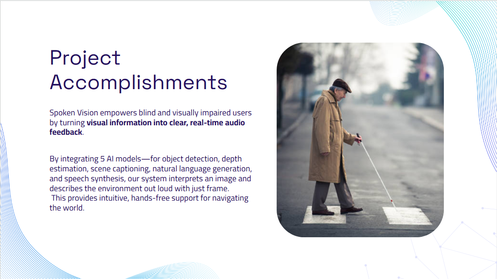

- When connecting to database, use data from DATABASE_PUBLIC_URL for PGHOST and PGPORT
- database creation needs quotes around column titles to keep caps
-  client might try to access server before its up, causing connect error. just restart client.

3
- Frontend: By default, when you use fetch('/gifts'), the browser tries to make the request to the same origin as your front-end. Make sure the server has the correct port.

- Remember to export getGiftsById in server/controllers/gift.js
- Make sure select queries have quotations
  

